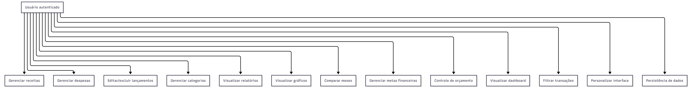
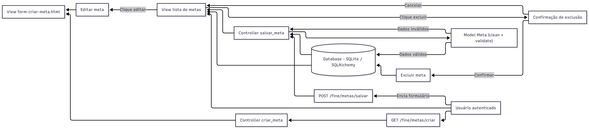
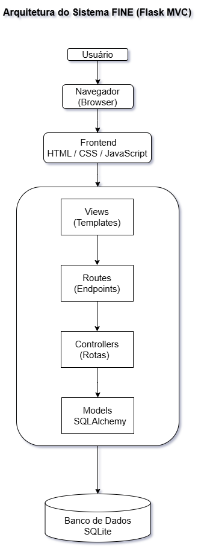
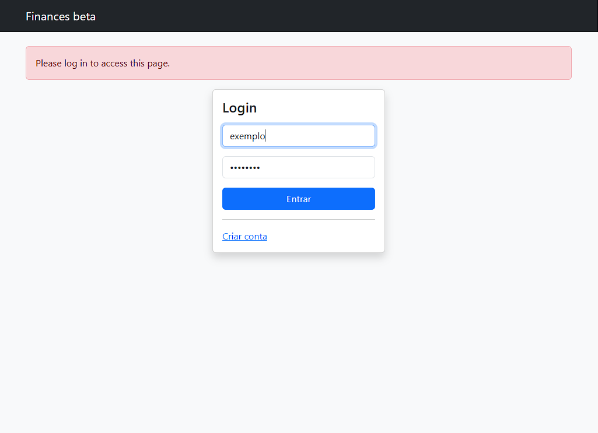
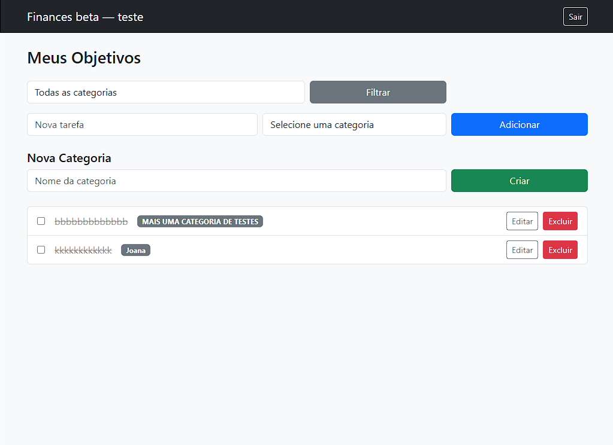
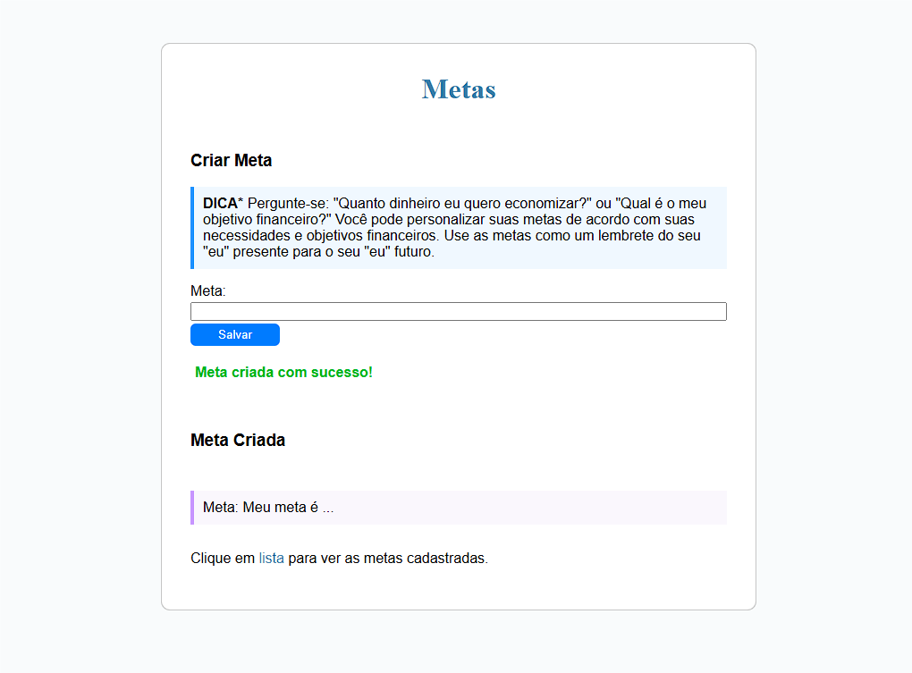
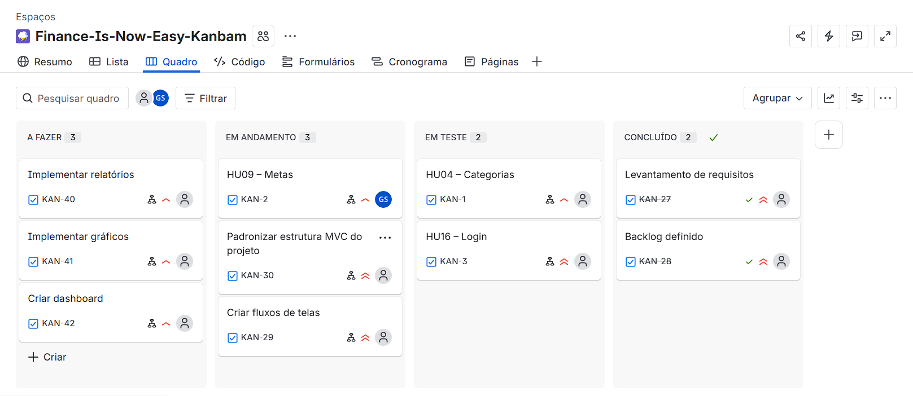

# Finance Is Now Easy (FINE)

> Sistema web para controle financeiro pessoal, permitindo o gerenciamento de receitas, despesas, metas e análise da situação financeira do usuário.


---

# 1. Identificação do Projeto

## Equipe

* Daniel Bacelar
* Diego Bacelar
* Gabriel Lopes
* Manuel 
* Wesley Romão

## Disciplina

Projeto Integrador I

## Professor

Ely Miranda

---

# 2. Problema a ser Resolvido

A falta de controle financeiro pessoal é um dos principais fatores que contribuem para o endividamento e para a má gestão do orçamento.
Muitas pessoas não possuem ferramentas simples e eficientes para registrar, acompanhar e analisar suas finanças.

---

# 3. Objetivo do Projeto

Desenvolver um sistema web de controle financeiro pessoal que permita ao usuário registrar, organizar e acompanhar suas receitas e despesas mensais.

O sistema também permitirá:

* Visualização de relatórios financeiros
* Geração de gráficos
* Acompanhamento do saldo mensal
* Planejamento financeiro através de metas

---

# 4. Público-Alvo

* Estudantes
* Trabalhadores autônomos
* Assalariados
* Pequenos empreendedores
* Pessoas que desejam organizar suas finanças pessoais

---

# 5. Tecnologias Utilizadas

| Área          | Tecnologia                              |
| ------------- | --------------------------------------- |
| Front-end     | HTML / CSS / JavaScript                 |
| Back-end      | Python (Flask)                          |
| Banco         | SQLite (local) / PostgreSQL (planejado) |
| Versionamento | Git / GitHub                            |
| Modelagem     | Mermaid                                 |
| Gestão        | Jira (planejado)                        |

---

# 6. Requisitos do Sistema

A documentação completa de requisitos está organizada na pasta:

`docs/requisitos/`

## Atores

Disponível em:
`docs/requisitos/atores.md`

## Product Backlog

Disponível em:
`docs/requisitos/backlog.md`

## Histórias de Usuário

Disponível em:
`docs/requisitos/historias-de-usuario.md`

## Regras de Negócio

Disponível em:
`docs/requisitos/regras-de-negocio.md`

---

## Resumo Geral

O sistema permite ao usuário:

* Registrar receitas e despesas
* Gerenciar categorias
* Criar metas financeiras
* Visualizar relatórios e gráficos
* Acompanhar saldo mensal
* Utilizar autenticação (login)

---

# 7. Modelagem do Sistema

## Diagrama de Casos de Uso



> Versão em Mermaid:
> `docs/modelagem/geral/casos-de-uso.md`

---

## Fluxo de Telas



> Exemplo de fluxo referente à HU09 – Metas financeiras.
> Versão completa dos fluxos disponível em:
> `docs/modelagem/fluxos/`

---

## Arquitetura



Status: Em desenvolvimento

---

## Modelo Entidade-Relacionamento

Ainda não finalizado.

Motivo: Modelagem de dados ainda em definição conforme evolução das funcionalidades.  
Previsão: Sprint 5  
Responsável: Equipe  

---

## Diagrama de Classes

Ainda não elaborado.

Motivo: Dependente da finalização da modelagem e estrutura completa do sistema.  
Previsão: Sprint 5  
Responsável: Equipe    

---

# 8. Protótipos

## Tela de Login



---

## Tela de Categorias



---

## Tela de Metas Financeiras



Responsável: Equipe
Status: Em desenvolvimento

---

# 9. Planejamento do Projeto

## Cronograma

| Etapa                      | Status       |
| -------------------------- | ------------ |
| Levantamento de requisitos | Concluído    |
| Modelagem                  | Em andamento |
| Implementação              | Pendente     |

## Sprints

| Sprint     | Descrição                                                                                                                                         |
| --------   | ------------------------------------------------------------------------------------------------------------------------------------------------- |
| Sprint 1   | Inception do projeto, definição da ideia, levantamento inicial de requisitos e visão do sistema                                                   |
| Sprint 2   | Construção e refinamento do Product Backlog (histórias de usuário, critérios de aceitação)                                                        |
| Sprint 3   | Prototipação simples das funcionalidades (HU01, HU02, HU04, HU09) e ajustes após orientação do professor                                          |
| Sprint 4   | Estruturação do backend com Flask (MVC), organização do repositório, documentação (README, modelagem) e desenvolvimento das HUs HU04, HU09 e HU16 |
| Sprint 5   | Continuação da implementação, integração das funcionalidades principais e estabilização do sistema                                                |

## Histórico de Entregas

* Entrega 1 (Sprint 1 e 2): definição do projeto, levantamento de requisitos e construção do backlog
* Entrega 2 (Sprint 3): prototipação inicial das funcionalidades (HU01, HU02, HU04, HU09)
* Entrega 3 (Sprint 4 - atual): estruturação do backend com Flask (MVC), organização do repositório e documentação do projeto

## Gestão das Tarefas



---

# 10. Banco de Dados

## Estrutura

Os scripts e definições do banco estarão disponíveis na pasta `/database`.

## Tecnologias

* SQLite (uso atual para desenvolvimento local)
* PostgreSQL (planejado via Render para ambiente em rede)

## Modelo Visual

Ainda não disponível.

Motivo: Modelo ER em desenvolvimento.  
Previsão: Sprint 5  
Responsável: Equipe  

## Observações

O sistema utiliza SQLAlchemy para integração com o banco de dados.

---

# 11. Implementação

## Backend

Desenvolvido com Flask seguindo o padrão MVC.

## Frontend

Utilização de HTML e CSS com templates renderizados pelo Flask.

## Funcionalidades em Desenvolvimento

* HU09 – Metas financeiras
* HU04 – Categorias
* HU16 – Login de usuário

## Observações

O desenvolvimento está sendo guiado pelas histórias de usuário definidas no backlog.

---

# 12. Evidências do Projeto

Ainda não disponíveis.

Motivo: Em atualização.  
Previsão: Sprint 5  
Responsável: Equipe  

---

# 13. Itens Ainda Não Produzidos

Alguns artefatos ainda estão em desenvolvimento ou não foram finalizados nesta etapa:

* Protótipos visuais (ex: Figma): ainda não desenvolvidos
* Arquitetura detalhada: em documentação
* Modelo Entidade-Relacionamento (ER): ainda não desenvolvido

---

# 14. Como Executar o Projeto

```bash
git clone https://github.com/catce2020111lmat0259-pixel/Finance_Is_Now_Easy
cd Finance_Is_Now_Easy
python -m venv .venv
.venv\Scripts\activate   # Windows
pip install -r requirements.txt
python main.py
```
