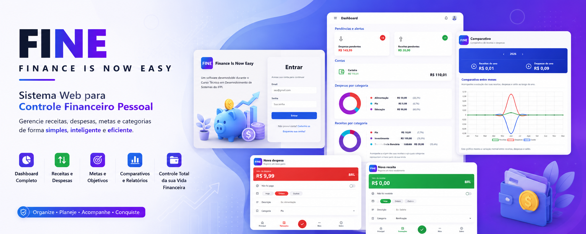
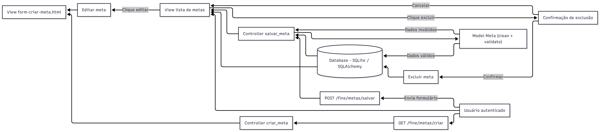
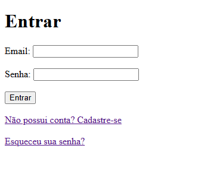
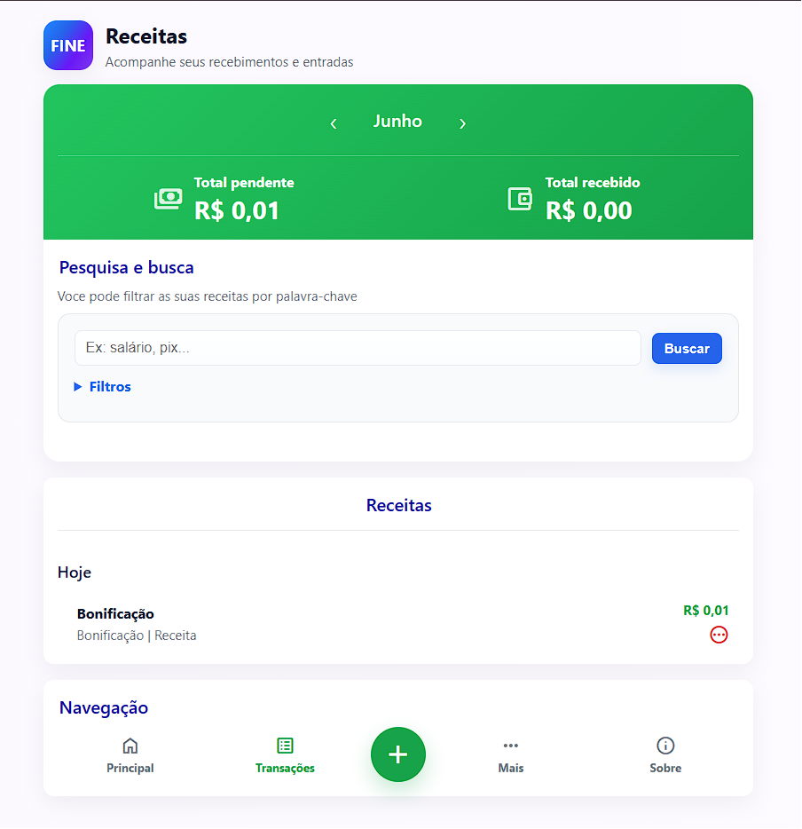

# Finance Is Now Easy (FINE)

> Sistema web para controle financeiro pessoal, permitindo o gerenciamento de receitas, despesas, metas e análise da situação financeira do usuário.



---

# 1. Identificação do Projeto

## Equipe

* Gabriel Lopes da Silva

## Disciplina

Projeto Integrador I

## Professor

Ely Miranda

---

# 2. Problema a ser Resolvido

A falta de controle financeiro pessoal é um dos principais fatores que contribuem para o endividamento e para a má gestão do orçamento.
Muitas pessoas não possuem ferramentas simples e eficientes para registrar, acompanhar e analisar suas finanças.

---

# 3. Objetivo do Projeto

Desenvolver um sistema web de controle financeiro pessoal que permita ao usuário registrar, organizar e acompanhar suas receitas e despesas mensais.

O sistema também permitirá:

* Visualização de relatórios financeiros
* Geração de gráficos
* Acompanhamento do saldo mensal
* Planejamento financeiro através de metas

---

# 4. Público-Alvo

* Estudantes
* Trabalhadores autônomos
* Assalariados
* Pequenos empreendedores
* Pessoas que desejam organizar suas finanças pessoais

---

# 5. Tecnologias Utilizadas

| Área                  | Tecnologia                                 |
| --------------------- | ------------------------------------------ |
| Front-end             | HTML5 / CSS3 / JavaScript                  |
| Back-end              | Python 3 / Flask                           |
| Banco de Dados        | SQLite                                     |
| ORM                   | SQLAlchemy                                 |
| Visualização de Dados | Chart.js                                   |
| Template Engine       | Jinja2                                     |
| Versionamento         | Git / GitHub                               |
| Modelagem             | Mermaid                                    |
| Gestão do Projeto     | Jira                                       |

---

# 6. Requisitos do Sistema

A documentação completa de requisitos está organizada na pasta:

`docs/requisitos/`

## Atores

Disponível em:
`docs/requisitos/atores.md`

## Product Backlog

Disponível em:
`docs/requisitos/backlog.md`

## Histórias de Usuário

Disponível em:
`docs/requisitos/historias-de-usuario.md`

## Regras de Negócio

Disponível em:
`docs/requisitos/regras-de-negocio.md`

---

## Resumo Geral

O sistema permite ao usuário:

* Cadastro e autenticação de usuários
* Gerenciamento de receitas e despesas
* Organização por categorias financeiras
* Controle de metas financeiras
* Visualização de gráficos e comparativos
* Acompanhamento do saldo financeiro
* Geração de relatórios para análise financeira

---

# 7. Modelagem do Sistema

## Diagrama de Casos de Uso


`docs/modelagem/geral/casos-de-uso.png`

> Versão em Mermaid:
> `docs/modelagem/geral/casos-de-uso.md`

---

## Fluxo de Telas



> Exemplo de fluxo referente à HU09 – Metas financeiras.
> Versão completa dos fluxos disponível em:
> `docs/modelagem/fluxos/`

---

## Arquitetura


`docs/modelagem/geral/arquitetura.png`

---

## Modelo Entidade-Relacionamento

O Modelo Entidade-Relacionamento do FINE foi definido com base nas principais entidades do sistema financeiro pessoal: usuários, receitas, despesas, categorias e metas.

A modelagem considera a separação dos dados por usuário autenticado, garantindo que cada usuário visualize apenas suas próprias informações.

### Entidades principais:
- **Usuário**
- **Receita**
- **Despesa**
- **Categoria**
- **Meta**

### Relacionamentos:
- Um usuário pode possuir várias receitas.
- Um usuário pode possuir várias despesas.
- Um usuário pode possuir várias categorias.
- Um usuário pode possuir várias metas.
- Uma receita pertence a uma categoria.
- Uma despesa pertence a uma categoria.
- Categorias pertencem a um usuário e são separadas por tipo: receita ou despesa.

O diagrama MER foi elaborado com base na estrutura final do banco de dados implementado no sistema.

O diagrama MER está disponível em:  
`docs/modelagem/geral/mer.md`

---

## Diagrama de Classes

O Diagrama de Classes foi elaborado a partir da estrutura MVC do sistema e dos models implementados com SQLAlchemy.

As principais classes representam as entidades persistidas no banco de dados e suas relações com o usuário autenticado.

### Classes principais:
- **Usuario**
- **Receita**
- **Despesa**
- **Categoria**
- **Meta**

### Responsabilidades principais:
- **Usuario:** armazena dados de autenticação e identificação do usuário.
- **Receita:** representa entradas financeiras cadastradas pelo usuário.
- **Despesa:** representa saídas financeiras cadastradas pelo usuário.
- **Categoria:** classifica receitas e despesas por tipo e cor.
- **Meta:** representa objetivos financeiros definidos pelo usuário.

O diagrama reflete a estrutura final do projeto FINE, considerando os relacionamentos entre usuários, categorias e lançamentos financeiros.

O Diagrama de Classes está disponível em:  
`docs/modelagem/geral/diagrama-classes.md`

---

# 8. Protótipo (final)

## Tela de Login



---

## Tela de Home

.png)

---

## Tela de Despesas


---

## Tela de Receitas



---

## Tela de comparativo

.png)

Responsável: Gabriel
Status: Concluída

---

# 9. Planejamento do Projeto

## Cronograma

| Etapa | Status |
|-------|--------|
| Levantamento de requisitos | ✅ Concluído |
| Modelagem | ✅ Concluído |
| Implementação | ✅ Concluído |
| Testes e Validação | ✅ Concluído |
| Documentação | ✅ Concluído |
| Entrega Final | ✅ Concluído |

---

## Sprints

| Sprint | Descrição |
|---------|-----------|
| Sprint 1 | Inception do projeto, definição da ideia, levantamento inicial de requisitos e visão geral do sistema. |
| Sprint 2 | Construção e refinamento do Product Backlog, histórias de usuário, regras de negócio, critérios de aceitação e modelagem inicial. |
| Sprint 3 | Prototipação das funcionalidades principais (HU01, HU02, HU04 e HU09), definição da identidade visual e evolução das interfaces. |
| Sprint 4 | Estruturação da arquitetura Flask MVC, organização do repositório, banco de dados, documentação e preparação do ambiente de desenvolvimento. |
| Sprint 5 | Implementação das funcionalidades principais: autenticação (HU15), persistência de dados (HU14), categorias (HU04), metas (HU09), receitas (HU01), despesas (HU02) e edição/exclusão de lançamentos (HU03). |
| Sprint 6 | Desenvolvimento dos filtros de pesquisa (HU13), dashboard (HU11), avisos e pendências (HU10), gráficos (HU07), comparativo entre meses (HU08), relatórios financeiros (HU06) e integração entre os módulos. |
| Sprint 7 | Refinamento da interface responsiva (HU12), geração de relatórios em PDF, criação da tela "Mais", tela "Sobre", ajustes finais, testes integrados, correção de bugs, documentação completa e preparação da versão final do sistema. |

---

## Histórico de Entregas

**Entrega 1 (Sprint 1 e 2)**

- Definição da proposta do projeto.
- Levantamento de requisitos.
- Regras de negócio.
- Construção do Product Backlog.
- Modelagem inicial.

---

**Entrega 2 (Sprint 3)**

- Protótipos das funcionalidades principais.
- Evolução da identidade visual.
- Estrutura inicial das interfaces.

---

**Entrega 3 (Sprint 4)**

- Arquitetura Flask MVC.
- Organização do repositório.
- Estrutura do banco de dados.
- Documentação inicial.

---

**Entrega 4 (Sprint 5)**

- Login e autenticação.
- Persistência de dados.
- CRUD de Categorias.
- CRUD de Metas.
- CRUD de Receitas.
- CRUD de Despesas.
- Edição e exclusão de lançamentos.

---

**Entrega 5 (Sprint 6)**

- Dashboard financeiro.
- Filtros e pesquisas.
- Gráficos por categoria.
- Comparativo entre meses.
- Relatórios financeiros em PDF.
- Avisos e pendências.
- Integração entre funcionalidades.

---

**Entrega Final (Sprint 7)**

- Refinamento da interface responsiva.
- Tela "Mais" e tela "Sobre".
- Meta principal fixada na Dashboard.
- Melhorias na navegação e experiência do usuário.
- Testes integrados e correção de inconsistências.
- Documentação completa do projeto.
- Preparação da versão final para apresentação.

## Gestão das Tarefas (atual)

.png)

---

# 10. Banco de Dados

## Estrutura

O sistema utiliza um banco de dados relacional para armazenar todas as informações financeiras dos usuários.

As definições das tabelas, modelos e scripts de criação encontram-se organizadas na pasta:

`/database`

Arquivos disponíveis:

- `fine_schema.sql` — estrutura das tabelas e relacionamentos do banco.
- `fine_seeds.sql` — dados iniciais de exemplo para utilização e testes.
- `modelo_er.png` — Modelo Entidade-Relacionamento (MER) do sistema.
- `README.md` — documentação da estrutura do banco de dados.

As principais entidades do sistema são:

- Usuário
- Receita
- Despesa
- Categoria
- Meta

Os relacionamentos entre essas entidades garantem a integridade dos dados e o isolamento das informações de cada usuário.

---

## Tecnologias

- SQLite (utilizado no ambiente de desenvolvimento)
- SQLAlchemy (ORM responsável pela persistência e gerenciamento das entidades)
- PostgreSQL (planejado para futura implantação em ambiente de produção)

---

## Modelo Visual

O Modelo Entidade-Relacionamento (MER) foi elaborado com base na estrutura final do banco de dados implementado no sistema.

Documentação disponível em:

- `database/modelo_er.png`
- `docs/modelagem/mer.md`

---

## Observações

- Todas as entidades possuem relacionamento com o usuário autenticado.
- Receitas e despesas são associadas a categorias.
- As categorias podem ser classificadas como **Receita** ou **Despesa**.
- Cada usuário possui seu próprio conjunto de categorias, receitas, despesas e metas.
- A persistência dos dados é realizada por meio do SQLAlchemy utilizando SQLite durante o desenvolvimento.

---

# 11. Implementação

## Backend

Desenvolvido em **Python** utilizando o framework **Flask**, seguindo a arquitetura **MVC (Model-View-Controller)**. A persistência dos dados foi implementada com **SQLAlchemy** e banco de dados **SQLite**, utilizando controle de sessão para autenticação e separação dos dados por usuário.

---

## Frontend

Desenvolvido com **HTML**, **CSS** e **JavaScript**, utilizando templates renderizados pelo Flask (Jinja2). A interface foi projetada para oferecer uma experiência responsiva, intuitiva e consistente em todos os módulos do sistema.

---

## Funcionalidades Implementadas

- HU01 – Inserção de receitas
- HU02 – Inserção de despesas
- HU03 – Edição e exclusão de lançamentos
- HU04 – Classificação por categorias
- HU05 – Resumo de despesas por categoria
- HU06 – Relatório financeiro mensal (PDF)
- HU07 – Gráficos por categoria
- HU08 – Comparativo entre meses
- HU09 – Metas financeiras
- HU10 – Avisos e pendências financeiras
- HU11 – Dashboard inicial
- HU12 – Interface responsiva
- HU13 – Filtros e pesquisas
- HU14 – Persistência de dados
- HU15 – Login e autenticação

---

## Observações

Todas as funcionalidades previstas para a versão final do projeto foram implementadas e integradas ao sistema. O desenvolvimento foi conduzido com base nas histórias de usuário, regras de negócio e arquitetura definida durante as etapas de planejamento, resultando em uma aplicação web funcional para gerenciamento financeiro pessoal.

---

# 12. Evidências do Projeto

As evidências do desenvolvimento encontram-se organizadas nas seguintes pastas do repositório:

- `docs/prototipos/`
- `docs/modelagem/`
- `docs/apresentacao/`
- `docs/planejamento/`

Entre as evidências disponíveis estão:

- Protótipos das principais telas do sistema
- Telas implementadas da aplicação
- Diagramas de Casos de Uso
- Fluxo de Telas
- Arquitetura do Sistema
- Modelo Entidade-Relacionamento (MER)
- Diagrama de Classes
- Quadro de acompanhamento do projeto (Jira)
- Cronograma e planejamento das sprints
- Banco de dados documentado
- Sistema em funcionamento
- Registro das funcionalidades implementadas

Essas evidências documentam a evolução do projeto desde o levantamento de requisitos até a implementação da versão final do sistema.

---

# 13. Como Executar o Projeto

```bash
git clone https://github.com/catce2020111lmat0259-pixel/Finance_Is_Now_Easy
cd Finance_Is_Now_Easy
python -m venv .venv
.venv\Scripts\activate   # Windows
pip install -r requirements.txt
python main.py
```
