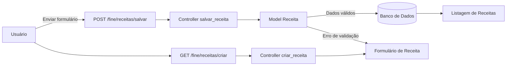

# Fluxo da Funcionalidade - HU01 (Inserir Receitas Manualmente)

## Descrição

Este documento descreve o fluxo completo da funcionalidade de cadastro de receitas, permitindo ao usuário registrar manualmente suas entradas financeiras para acompanhamento do saldo e geração de relatórios.

## Responsável

Gabriel Lopes

## História de Usuário

Como usuário do sistema, quero inserir minhas receitas manualmente (ex.: salário, mesada), para acompanhar minha entrada de dinheiro.

---

## Definição

O cadastro de receitas permite registrar todas as entradas financeiras do usuário, armazenando informações como valor, data, categoria, descrição e status de recebimento.

### Características

- Cadastro manual de receitas
- Associação a uma categoria do tipo **Receita**
- Registro da data da receita
- Campo opcional para descrição
- Controle do status (**Recebido** ou **Não recebido**)
- Persistência em banco de dados
- Disponível para edição, exclusão, pesquisa e relatórios

---

## Regras de Negócio

- Apenas usuários autenticados podem cadastrar receitas
- O valor da receita deve ser maior que zero
- A data da receita é obrigatória
- Toda receita deve possuir uma categoria do tipo **Receita**
- A categoria deve pertencer ao próprio usuário ou ser uma categoria padrão do sistema
- O sistema deve validar os campos obrigatórios antes do cadastro
- O sistema deve impedir valores negativos ou inválidos
- O cadastro é associado ao usuário autenticado

---

## Fluxo da Funcionalidade

### Acesso ao formulário

1. Usuário autenticado acessa (`GET /fine/receitas/criar`)
2. Sistema exibe formulário contendo:
   - Valor
   - Data
   - Categoria
   - Descrição
   - Status (Recebido / Não recebido)

---

### Cadastro da receita

3. Usuário preenche o formulário

4. Usuário envia o formulário (`POST /fine/receitas/salvar`)

---

### Validação

5. Sistema valida:

- Usuário autenticado
- Valor válido e maior que zero
- Categoria informada
- Data preenchida
- Categoria pertencente ao usuário

---

### Falha na validação

6. Caso exista algum erro:

- Sistema exibe mensagens de validação
- Mantém os dados preenchidos no formulário
- Não realiza o cadastro

---

### Cadastro realizado

7. Caso os dados sejam válidos:

- Cria a receita
- Associa ao usuário autenticado
- Persiste no banco de dados
- Atualiza o saldo financeiro
- Redireciona para a listagem de receitas

---

## Critérios de Aceitação

**CA01 — Exibição do formulário**

Dado que o usuário está autenticado

Quando acessar a tela de cadastro

Então o sistema deve exibir o formulário de criação de receita.

---

**CA02 — Cadastro válido**

Dado que todos os campos obrigatórios foram preenchidos corretamente

Quando confirmar o cadastro

Então a receita deve ser registrada no banco de dados.

---

**CA03 — Valor inválido**

Dado que o usuário informa valor menor ou igual a zero

Quando tentar cadastrar

Então o sistema deve impedir o cadastro e informar o erro.

---

**CA04 — Categoria obrigatória**

Dado que nenhuma categoria foi selecionada

Quando tentar cadastrar

Então o sistema deve impedir o cadastro.

---

**CA05 — Usuário não autenticado**

Dado que não existe sessão ativa

Quando acessar qualquer rota de cadastro de receita

Então o sistema deve redirecionar para a tela de login.

---

**CA06 — Associação ao usuário**

Dado que o cadastro foi realizado com sucesso

Quando a receita for salva

Então ela deve ficar vinculada exclusivamente ao usuário autenticado.

---

## Diagrama (Mermaid)

