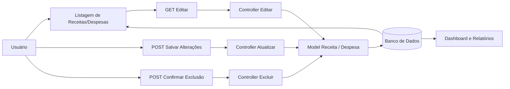

# Fluxo da Funcionalidade - HU03 (Editar e Excluir Lançamentos)

## Descrição

Este documento descreve o fluxo completo da funcionalidade de edição e exclusão de lançamentos financeiros, permitindo ao usuário atualizar ou remover receitas e despesas previamente cadastradas.

## Responsável

Gabriel Lopes

## História de Usuário

Como usuário do sistema, quero editar ou excluir lançamentos já registrados, para manter meus dados atualizados.

---

## Definição

A funcionalidade permite alterar ou remover lançamentos financeiros existentes, garantindo que as informações permaneçam corretas e atualizadas durante a utilização do sistema.

### Características

- Edição de receitas cadastradas
- Edição de despesas cadastradas
- Exclusão de receitas
- Exclusão de despesas
- Confirmação antes da exclusão
- Atualização imediata dos dados armazenados
- Recalculo automático dos indicadores financeiros

---

## Regras de Negócio

- Apenas usuários autenticados podem editar ou excluir lançamentos.
- O usuário pode editar apenas seus próprios lançamentos.
- Os dados editados devem passar pelas mesmas validações do cadastro.
- A exclusão deve solicitar confirmação antes de remover o lançamento.
- Após a edição ou exclusão, o Dashboard e os relatórios devem refletir as alterações.

---

## Fluxo da Funcionalidade

### Edição de lançamento

1. Usuário acessa a listagem de receitas ou despesas.
2. Seleciona um lançamento existente.
3. Sistema abre o formulário de edição (`GET`).
4. Usuário altera as informações desejadas.
5. Sistema valida os dados informados.
6. Se válidos:
   - Atualiza o lançamento no banco de dados.
   - Recalcula os indicadores financeiros.
   - Redireciona para a listagem correspondente.

---

### Exclusão de lançamento

7. Usuário acessa a tela de edição do lançamento.
8. Seleciona a opção **Excluir**.
9. Sistema solicita confirmação da exclusão.
10. Usuário confirma a operação.
11. Sistema remove o lançamento do banco de dados.
12. Dashboard, gráficos e relatórios são atualizados automaticamente.

---

## Critérios de Aceitação

**CA01 — Editar lançamento**

Dado que exista um lançamento cadastrado

Quando o usuário alterar seus dados

Então o sistema deve atualizar o lançamento.

---

**CA02 — Validação dos dados**

Dado que o usuário informe dados inválidos

Quando tentar salvar

Então o sistema deve impedir a atualização e informar o erro.

---

**CA03 — Exclusão de lançamento**

Dado que exista um lançamento

Quando o usuário confirmar sua exclusão

Então o sistema deve remover o registro permanentemente.

---

**CA04 — Confirmação de exclusão**

Dado que o usuário clique em excluir

Quando a operação for iniciada

Então o sistema deve solicitar confirmação antes de remover o lançamento.

---

**CA05 — Atualização automática**

Dado que um lançamento tenha sido editado ou excluído

Quando a operação for concluída

Então Dashboard, gráficos, comparativos e relatórios devem refletir automaticamente as alterações.

---

## Diagrama (Mermaid)

