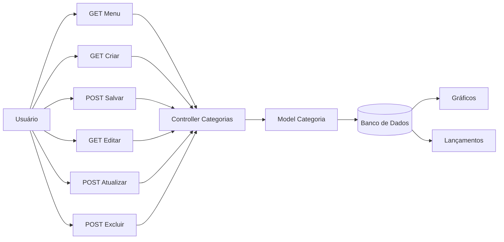

# Fluxo da Funcionalidade - HU04 (Classificação por Categorias)

## Descrição

Este documento descreve o fluxo completo da funcionalidade de gerenciamento de categorias, permitindo ao usuário organizar receitas e despesas por categorias personalizadas ou padrão, facilitando a visualização, os gráficos e os relatórios financeiros.

## Responsável

Gabriel Lopes

## História de Usuário

Como usuário do sistema, quero classificar receitas e despesas por categorias, para organizar melhor minhas finanças.

---

## Definição

A funcionalidade de categorias permite classificar lançamentos financeiros por tipo, diferenciando receitas e despesas por meio de categorias específicas.

O sistema disponibiliza categorias padrão e permite ao usuário criar categorias próprias, incluindo descrição e cor personalizada para utilização nos gráficos do sistema.

### Características

- Categorias separadas em **Receitas** e **Despesas**
- Categorias padrão do sistema
- Criação de categorias personalizadas
- Edição de categorias
- Exclusão de categorias personalizadas
- Personalização da cor da categoria
- Associação automática aos lançamentos financeiros
- Utilização das categorias em gráficos e relatórios

---

## Regras de Negócio

- Apenas usuários autenticados podem gerenciar categorias.
- Toda categoria deve possuir um nome.
- A categoria deve possuir um tipo (**Receita** ou **Despesa**).
- Categorias padrão não podem ser excluídas.
- Categorias padrão permitem apenas alteração da cor.
- Categorias personalizadas podem ser editadas ou excluídas.
- As categorias são vinculadas ao usuário autenticado.
- As cores personalizadas devem ser refletidas automaticamente nos gráficos do sistema.

---

## Fluxo da Funcionalidade

### Visualização

1. Usuário acessa (`GET /fine/categorias/menu`).
2. Sistema apresenta:
   - Categorias de Receita.
   - Categorias de Despesa.
   - Categorias padrão.
   - Categorias personalizadas.

---

### Cadastro

3. Usuário acessa (`GET /fine/categorias/criar`).

4. Sistema exibe formulário contendo:

- Nome
- Tipo
- Descrição
- Cor

5. Usuário envia o formulário (`POST /fine/categorias/salvar`).

6. Sistema valida os dados.

7. Caso válidos:

- Cria a categoria.
- Associa ao usuário autenticado.
- Salva no banco de dados.
- Atualiza automaticamente as listas de categorias.

---

### Edição

8. Usuário seleciona uma categoria existente.

9. Sistema exibe a tela de edição.

10. Usuário altera as informações permitidas.

11. Sistema valida e atualiza o cadastro.

---

### Exclusão

12. Usuário seleciona uma categoria personalizada.

13. Sistema solicita confirmação da exclusão.

14. Após confirmação:

- Remove a categoria.
- Atualiza a listagem.

---

## Critérios de Aceitação

**CA01 — Cadastro de categoria**

Dado que o usuário esteja autenticado

Quando preencher corretamente o formulário

Então o sistema deve cadastrar a categoria.

---

**CA02 — Separação por tipo**

Dado que existam categorias cadastradas

Quando forem exibidas

Então o sistema deve separá-las entre Receitas e Despesas.

---

**CA03 — Categorias padrão**

Dado que a categoria seja padrão

Quando o usuário tentar editá-la

Então apenas sua cor poderá ser alterada.

---

**CA04 — Exclusão**

Dado que a categoria seja personalizada

Quando o usuário confirmar sua exclusão

Então ela deve ser removida do sistema.

---

**CA05 — Associação aos lançamentos**

Dado que uma receita ou despesa seja cadastrada

Quando o usuário selecionar uma categoria

Então o lançamento deve permanecer associado à categoria escolhida.

---

**CA06 — Personalização da cor**

Dado que o usuário altere a cor de uma categoria

Quando salvar a alteração

Então os gráficos devem utilizar automaticamente a nova cor.

---

## Diagrama (Mermaid)

