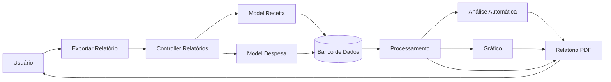

# Fluxo da Funcionalidade - HU06 (Relatório Mensal)

## Descrição

Este documento descreve o fluxo completo da funcionalidade de geração de relatório financeiro mensal, permitindo ao usuário visualizar um resumo consolidado de suas receitas e despesas, além de exportar essas informações em formato PDF para consulta externa.

## Responsável

Gabriel Lopes da Silva

## História de Usuário

Como usuário do sistema, quero visualizar um relatório mensal de receitas e despesas e exportar os dados, para analisá-los fora do sistema.

---

## Definição

A funcionalidade de relatório mensal reúne automaticamente as informações financeiras do usuário para o período selecionado, apresentando indicadores, análises e tabelas consolidadas em um documento PDF.

O relatório é gerado automaticamente pelo sistema e possui identidade visual própria do FINE.

### Características

- Geração automática de relatório em PDF
- Cabeçalho personalizado com identidade visual do FINE
- Resumo financeiro do período
- Análise automática da situação financeira
- Gráfico comparativo anual
- Tabela com resumo mensal
- Listagem de receitas do período
- Listagem de despesas do período
- Download automático do documento

---

## Regras de Negócio

- Apenas usuários autenticados podem gerar relatórios.
- O relatório deve considerar apenas os dados do usuário autenticado.
- O sistema deve calcular automaticamente receitas, despesas e saldo do período.
- O relatório deve conter todos os lançamentos do mês selecionado.
- O documento deve ser exportado em formato PDF.
- O sistema deve gerar automaticamente uma análise financeira baseada nos dados do período.

---

## Fluxo da Funcionalidade

### Solicitação do relatório

1. Usuário acessa a opção **Exportar Relatório**.

2. Sistema identifica o usuário autenticado.

3. Sistema recupera todas as receitas e despesas do período.

---

### Processamento

4. Sistema calcula:

- Total de receitas
- Total de despesas
- Saldo financeiro
- Resumo mensal
- Comparativo anual
- Dados para geração do gráfico

---

### Análise automática

5. O sistema analisa a situação financeira:

- Saldo positivo
- Saldo negativo
- Situação de atenção quando as despesas representam grande parte das receitas

---

### Geração do documento

6. Sistema monta o relatório contendo:

- Cabeçalho institucional
- Dados do usuário
- Período analisado
- Resumo financeiro
- Análise automática
- Gráfico comparativo
- Tabela mensal
- Receitas
- Despesas

---

### Exportação

7. Sistema gera o arquivo PDF.

8. Documento é disponibilizado automaticamente para download.

---

## Critérios de Aceitação

**CA01 — Geração do relatório**

Dado que o usuário esteja autenticado

Quando solicitar a exportação

Então o sistema deve gerar o relatório financeiro.

---

**CA02 — Dados do usuário**

Dado que existam receitas e despesas cadastradas

Quando o relatório for gerado

Então somente os dados do usuário autenticado devem ser considerados.

---

**CA03 — Resumo financeiro**

Dado que existam movimentações financeiras

Quando o relatório for criado

Então o sistema deve apresentar receitas, despesas e saldo do período.

---

**CA04 — Análise automática**

Dado que o relatório seja gerado

Quando os cálculos forem concluídos

Então o sistema deve apresentar uma análise financeira baseada no saldo obtido.

---

**CA05 — Exportação**

Dado que o relatório tenha sido gerado

Quando o processamento for concluído

Então o sistema deve disponibilizar o arquivo em formato PDF.

---

## Diagrama (Mermaid)

