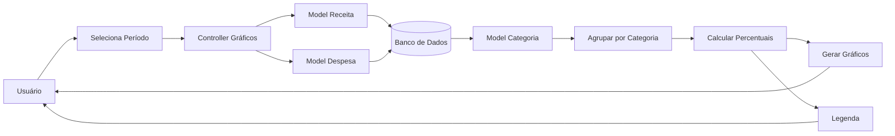

# Fluxo da Funcionalidade - HU07 (Gráficos por Categoria)

## Descrição

Este documento descreve o fluxo completo da funcionalidade de gráficos financeiros por categoria, permitindo ao usuário visualizar a distribuição de receitas e despesas de forma gráfica para facilitar a interpretação das informações financeiras.

## Responsável

Gabriel Lopes da Silva

## História de Usuário

Como usuário do sistema, quero gráficos (pizza e/ou barras) mostrando gastos por categoria, para tornar a visualização e interpretação mais clara.

---

## Definição

A funcionalidade gera automaticamente gráficos financeiros com base nas categorias cadastradas pelo usuário, apresentando a distribuição proporcional dos valores de receitas e despesas durante o período selecionado.

Além da representação gráfica, o sistema apresenta legenda, percentuais e valores correspondentes a cada categoria.

### Características

- Gráfico de pizza para despesas por categoria
- Gráfico de pizza para receitas por categoria
- Legenda automática
- Percentual de participação por categoria
- Utilização das cores personalizadas das categorias
- Atualização automática conforme os lançamentos
- Mensagem quando não houver dados disponíveis

---

## Regras de Negócio

- Apenas dados do usuário autenticado devem ser considerados.
- Os gráficos devem utilizar apenas movimentações do período selecionado.
- Cada categoria deve utilizar sua cor personalizada.
- O percentual de cada categoria deve ser calculado automaticamente.
- Caso não existam lançamentos no período, o sistema deve informar a ausência de dados.
- Alterações nas receitas, despesas ou categorias devem atualizar automaticamente os gráficos.

---

## Fluxo da Funcionalidade

### Seleção do período

1. Usuário acessa a tela de gráficos.

2. Sistema identifica o mês e ano selecionados.

3. Caso nenhum período seja informado, utiliza o mês atual.

---

### Processamento

4. Sistema consulta:

- Receitas do período.
- Despesas do período.
- Categorias correspondentes.

5. Sistema agrupa os lançamentos por categoria.

6. Calcula:

- Valor total por categoria.
- Percentual de participação.
- Cor utilizada no gráfico.

---

### Geração dos gráficos

7. Sistema monta automaticamente:

- Gráfico de despesas.
- Gráfico de receitas.

8. Sistema gera a legenda contendo:

- Nome da categoria.
- Valor total.
- Percentual correspondente.

---

### Ausência de dados

9. Caso não existam lançamentos no período:

- O gráfico não é exibido.
- Sistema apresenta mensagem informativa ao usuário.

---

## Critérios de Aceitação

**CA01 — Exibição dos gráficos**

Dado que existam lançamentos cadastrados

Quando o usuário acessar a tela de gráficos

Então o sistema deve apresentar os gráficos financeiros.

---

**CA02 — Percentuais**

Dado que existam categorias com movimentações

Quando os gráficos forem gerados

Então o sistema deve calcular automaticamente o percentual correspondente de cada categoria.

---

**CA03 — Cores personalizadas**

Dado que uma categoria possua cor definida

Quando o gráfico for exibido

Então essa cor deve ser utilizada na representação gráfica.

---

**CA04 — Atualização automática**

Dado que receitas, despesas ou categorias sejam alteradas

Quando o usuário acessar novamente os gráficos

Então os dados devem refletir automaticamente as alterações realizadas.

---

**CA05 — Ausência de dados**

Dado que não existam movimentações no período

Quando o usuário acessar a tela de gráficos

Então o sistema deve informar que não existem dados suficientes para gerar os gráficos.

---

## Diagrama (Mermaid)

