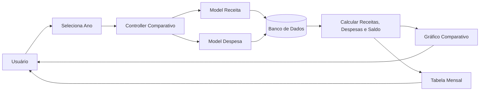

# Fluxo da Funcionalidade - HU08 (Comparativo entre Meses)

## Descrição

Este documento descreve o fluxo completo da funcionalidade de comparativo financeiro entre meses, permitindo ao usuário acompanhar a evolução de suas receitas, despesas e saldo ao longo do ano.

## Responsável

Gabriel Lopes da Silva

## História de Usuário

Como usuário do sistema, quero um comparativo entre meses (quanto gastei em janeiro, fevereiro, março, etc.), para manter o controle mensal de gastos.

---

## Definição

A funcionalidade apresenta uma visão consolidada da movimentação financeira do usuário durante um determinado ano, permitindo comparar receitas, despesas e saldo de cada mês por meio de gráficos e tabelas.

### Características

- Comparativo anual de receitas, despesas e saldo
- Seleção do ano desejado
- Gráfico de linhas
- Resumo mensal em tabela
- Atualização automática conforme os lançamentos
- Mensagem quando não houver dados disponíveis

---

## Regras de Negócio

- Apenas os dados do usuário autenticado devem ser considerados.
- O sistema deve calcular automaticamente receitas, despesas e saldo de cada mês.
- O comparativo deve considerar apenas o ano selecionado.
- Alterações nos lançamentos devem atualizar automaticamente os resultados.
- Caso não existam movimentações no ano selecionado, o sistema deve informar a ausência de registros.

---

## Fluxo da Funcionalidade

### Seleção do período

1. Usuário acessa a tela de comparativo financeiro.

2. Sistema apresenta o seletor de ano.

3. Usuário escolhe o ano desejado.

---

### Processamento

4. Sistema consulta todas as receitas e despesas do usuário referentes ao ano selecionado.

5. Para cada mês, calcula:

- Total de receitas;
- Total de despesas;
- Saldo mensal.

---

### Exibição

6. Sistema apresenta:

- Gráfico comparativo de linhas;
- Tabela com os valores de cada mês;
- Resumo anual.

---

### Atualização

7. Sempre que uma receita ou despesa for:

- cadastrada;
- editada;
- excluída;

o comparativo é recalculado automaticamente.

---

### Ausência de dados

8. Caso não existam registros no período selecionado:

- O gráfico não é exibido.
- O sistema apresenta mensagem informando que não existem movimentações para o ano escolhido.

---

## Critérios de Aceitação

**CA01 — Seleção do ano**

Dado que o usuário esteja autenticado

Quando acessar a tela de comparativo

Então o sistema deve permitir selecionar o ano desejado.

---

**CA02 — Comparativo mensal**

Dado que existam movimentações financeiras

Quando o comparativo for gerado

Então o sistema deve calcular receitas, despesas e saldo de cada mês.

---

**CA03 — Exibição gráfica**

Dado que existam dados suficientes

Quando o comparativo for exibido

Então o sistema deve apresentar um gráfico representando a evolução financeira ao longo do ano.

---

**CA04 — Resumo anual**

Dado que o comparativo tenha sido gerado

Quando a tela for apresentada

Então o sistema deve exibir uma tabela contendo os valores de todos os meses.

---

**CA05 — Atualização automática**

Dado que receitas ou despesas sejam alteradas

Quando o comparativo for acessado novamente

Então os resultados devem refletir automaticamente as alterações.

---

**CA06 — Ausência de registros**

Dado que não existam movimentações para o ano selecionado

Quando o usuário acessar o comparativo

Então o sistema deve informar que não há dados disponíveis.

---

## Diagrama (Mermaid)

