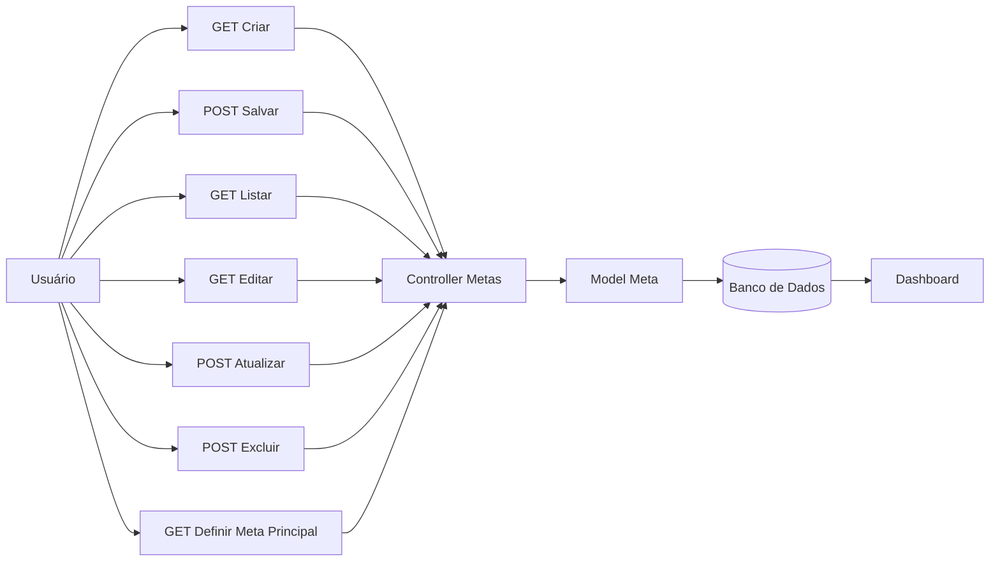

# Fluxo da Funcionalidade - HU09 (Metas Financeiras)

## Descrição

Este documento descreve o fluxo completo da funcionalidade de gerenciamento de metas financeiras, permitindo ao usuário criar, editar, excluir e definir uma meta principal para acompanhamento na tela inicial do sistema.

## Responsável

Gabriel Lopes da Silva

## História de Usuário

Como usuário do sistema, quero criar e personalizar metas financeiras, para organizar melhor meus objetivos e acompanhar meu planejamento financeiro.

---

## Definição

A funcionalidade de metas permite ao usuário registrar objetivos financeiros personalizados, facilitando o planejamento e mantendo uma meta em destaque na tela inicial do sistema.

### Características

- Cadastro de metas financeiras
- Listagem de metas cadastradas
- Edição de metas
- Exclusão de metas
- Definição de uma meta principal
- Exibição da meta principal na Dashboard
- Persistência em banco de dados

---

## Regras de Negócio

- Apenas usuários autenticados podem gerenciar metas.
- Cada meta deve possuir uma descrição válida.
- As metas são vinculadas ao usuário autenticado.
- O usuário pode editar ou excluir suas próprias metas.
- Apenas uma meta pode permanecer definida como principal por vez.
- Ao definir uma nova meta principal, a anterior deixa automaticamente de ser a principal.

---

## Fluxo da Funcionalidade

### Cadastro

1. Usuário acessa (`GET /fine/metas/criar`).

2. Sistema apresenta o formulário de cadastro.

3. Usuário informa a descrição da meta.

4. Sistema valida os dados.

5. Caso válidos:

- Salva a meta.
- Associa ao usuário autenticado.
- Exibe a meta na listagem.

---

### Listagem

6. Usuário acessa (`GET /fine/metas/listar`).

7. Sistema apresenta todas as metas cadastradas pelo usuário.

---

### Edição

8. Usuário seleciona uma meta.

9. Sistema abre o formulário de edição.

10. Usuário altera a descrição.

11. Sistema valida e atualiza os dados.

---

### Exclusão

12. Usuário seleciona uma meta.

13. Sistema solicita confirmação da exclusão.

14. Após confirmação:

- Remove a meta.
- Atualiza a listagem.

---

### Meta principal

15. Usuário seleciona a opção **Definir como principal**.

16. Sistema remove automaticamente a marcação da meta anteriormente definida.

17. Nova meta passa a ser exibida na Dashboard.

---

## Critérios de Aceitação

**CA01 — Cadastro de meta**

Dado que o usuário esteja autenticado

Quando cadastrar uma meta válida

Então ela deve ser armazenada no banco de dados.

---

**CA02 — Listagem**

Dado que existam metas cadastradas

Quando acessar a tela de metas

Então o sistema deve apresentar todas as metas do usuário.

---

**CA03 — Edição**

Dado que exista uma meta cadastrada

Quando o usuário alterar sua descrição

Então o sistema deve atualizar os dados.

---

**CA04 — Exclusão**

Dado que exista uma meta cadastrada

Quando o usuário confirmar sua exclusão

Então ela deve ser removida permanentemente.

---

**CA05 — Meta principal**

Dado que o usuário escolha uma meta como principal

Quando confirmar a ação

Então ela deve ser exibida na Dashboard.

---

**CA06 — Apenas uma meta principal**

Dado que já exista uma meta principal

Quando outra meta for definida como principal

Então a anterior deve perder automaticamente essa marcação.

---

## Diagrama (Mermaid)

