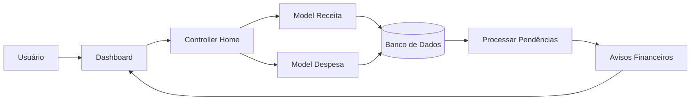

# Fluxo da Funcionalidade - HU10 (Avisos e Pendências)

## Descrição

Este documento descreve o fluxo completo da funcionalidade de avisos e pendências financeiras, responsável por informar automaticamente ao usuário situações que merecem atenção durante a utilização do sistema.

## Responsável

Gabriel Lopes da Silva

## História de Usuário

Como usuário do sistema, quero receber avisos e visualizar pendências financeiras, para identificar situações que necessitam de atenção e tomar decisões de forma preventiva.

---

## Definição

A funcionalidade monitora automaticamente os dados financeiros cadastrados pelo usuário e apresenta avisos relacionados a despesas pendentes, receitas não recebidas e situações financeiras relevantes.

Os avisos são exibidos na Dashboard e atualizados sempre que ocorrer alguma alteração nas movimentações financeiras.

### Características

- Avisos automáticos
- Identificação de despesas pendentes
- Identificação de receitas não recebidas
- Atualização automática
- Exibição na Dashboard
- Integração com receitas e despesas

---

## Regras de Negócio

- Apenas informações do usuário autenticado devem ser consideradas.
- O sistema deve identificar automaticamente despesas pendentes.
- O sistema deve identificar receitas ainda não recebidas.
- Os avisos devem ser atualizados após qualquer alteração nas movimentações.
- Caso não existam pendências, o sistema deve informar que não há avisos no momento.

---

## Fluxo da Funcionalidade

### Verificação automática

1. Usuário acessa a Dashboard.

2. Sistema consulta:

- Receitas cadastradas;
- Despesas cadastradas;
- Situação de cada lançamento.

---

### Processamento

3. Sistema verifica:

- Despesas marcadas como pendentes;
- Receitas marcadas como não recebidas;
- Outras situações que necessitem de atenção.

---

### Exibição

4. Caso existam pendências:

- Sistema apresenta os avisos na Dashboard.

5. Caso não existam pendências:

- Sistema informa que não há avisos financeiros no momento.

---

### Atualização

6. Sempre que uma receita ou despesa for:

- cadastrada;
- editada;
- excluída;
- alterada entre pago/pendente ou recebido/não recebido;

o sistema recalcula automaticamente os avisos.

---

## Critérios de Aceitação

**CA01 — Verificação automática**

Dado que o usuário esteja autenticado

Quando acessar a Dashboard

Então o sistema deve verificar automaticamente suas pendências financeiras.

---

**CA02 — Despesas pendentes**

Dado que existam despesas pendentes

Quando os avisos forem gerados

Então o sistema deve informar a existência dessas pendências.

---

**CA03 — Receitas não recebidas**

Dado que existam receitas marcadas como não recebidas

Quando os avisos forem exibidos

Então o sistema deve informar essa situação.

---

**CA04 — Ausência de pendências**

Dado que não existam pendências financeiras

Quando a Dashboard for carregada

Então o sistema deve informar que não existem avisos no momento.

---

**CA05 — Atualização automática**

Dado que uma movimentação seja alterada

Quando a operação for concluída

Então os avisos devem ser recalculados automaticamente.

---

## Diagrama (Mermaid)

