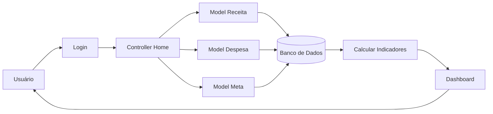

# Fluxo da Funcionalidade - HU11 (Dashboard Inicial)

## Descrição

Este documento descreve o fluxo completo da Dashboard do FINE, responsável por apresentar uma visão consolidada da situação financeira do usuário logo após sua autenticação.

## Responsável

Gabriel Lopes da Silva

## História de Usuário

Como usuário, quero visualizar no dashboard inicial o saldo atual, o total de receitas e o total de despesas do período, para ter uma visão rápida da minha situação financeira.

---

## Definição

A Dashboard reúne os principais indicadores financeiros do usuário em uma única tela, permitindo acompanhar rapidamente sua situação financeira sem necessidade de acessar outras funcionalidades.

Além dos indicadores financeiros, a Dashboard apresenta avisos, movimentações recentes, atalhos para funcionalidades e a meta principal definida pelo usuário.

### Características

- Exibição do saldo atual
- Total de receitas do período
- Total de despesas do período
- Resumo financeiro mensal
- Avisos e pendências financeiras
- Últimas movimentações
- Meta principal
- Navegação rápida para os principais módulos
- Atualização automática dos indicadores

---

## Regras de Negócio

- Apenas usuários autenticados podem acessar a Dashboard.
- Os indicadores devem considerar apenas os dados do usuário autenticado.
- O saldo deve ser calculado automaticamente a partir das receitas e despesas.
- Caso não existam movimentações financeiras, os valores devem ser apresentados como zero.
- Alterações em receitas, despesas ou metas devem atualizar automaticamente a Dashboard.

---

## Fluxo da Funcionalidade

### Acesso

1. Usuário realiza login no sistema.

2. Sistema redireciona para a Dashboard.

---

### Processamento

3. Sistema consulta:

- Receitas do usuário;
- Despesas do usuário;
- Meta principal;
- Pendências financeiras;
- Últimas movimentações.

---

### Cálculo dos indicadores

4. Sistema calcula automaticamente:

- Total de receitas;
- Total de despesas;
- Saldo atual;
- Resumo financeiro do período.

---

### Exibição

5. Sistema apresenta:

- Saldo atual;
- Total de receitas;
- Total de despesas;
- Meta principal;
- Avisos financeiros;
- Últimas movimentações;
- Atalhos para os módulos do sistema.

---

### Atualização

6. Sempre que uma receita, despesa ou meta for cadastrada, editada ou excluída:

- Os indicadores são recalculados automaticamente.
- A Dashboard passa a refletir imediatamente as novas informações.

---

## Critérios de Aceitação

**CA01 — Exibição dos indicadores**

Dado que o usuário esteja autenticado

Quando acessar a Dashboard

Então o sistema deve apresentar saldo, receitas e despesas.

---

**CA02 — Valores zerados**

Dado que não existam movimentações financeiras

Quando a Dashboard for carregada

Então todos os indicadores financeiros devem apresentar valor zero.

---

**CA03 — Atualização automática**

Dado que receitas, despesas ou metas sejam alteradas

Quando o usuário retornar à Dashboard

Então os indicadores devem refletir automaticamente as alterações realizadas.

---

**CA04 — Meta principal**

Dado que exista uma meta definida como principal

Quando a Dashboard for exibida

Então ela deve aparecer em destaque.

---

**CA05 — Avisos financeiros**

Dado que existam pendências financeiras

Quando a Dashboard for carregada

Então o sistema deve apresentar os avisos correspondentes.

---

## Diagrama (Mermaid)

