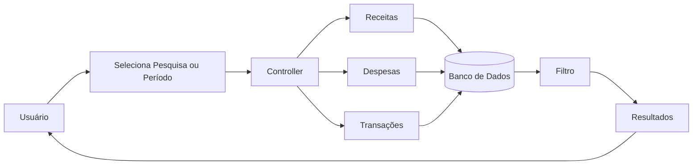

# Fluxo da Funcionalidade - HU13 (Filtros de Pesquisa)

## Descrição

Este documento descreve o fluxo completo da funcionalidade de filtros de pesquisa, permitindo ao usuário localizar rapidamente receitas, despesas e transações por meio de pesquisas e filtros por período.

## Responsável

Gabriel Lopes da Silva

## História de Usuário

Como usuário financeiro, quero filtrar minhas transações por categoria ou período, para encontrar lançamentos específicos e analisar minhas movimentações financeiras de forma segmentada.

---

## Definição

A funcionalidade de filtros permite ao usuário restringir a visualização das informações financeiras conforme critérios de pesquisa e período, facilitando a localização de lançamentos e a análise das movimentações cadastradas.

Os filtros são utilizados em diferentes módulos do sistema, como receitas, despesas, transações, gráficos e comparativos financeiros.

### Características

- Pesquisa textual de lançamentos
- Filtro por mês e ano
- Navegação entre meses
- Atualização automática das listagens
- Integração com gráficos e comparativos
- Exibição de mensagens quando não houver resultados

---

## Regras de Negócio

- Apenas dados do usuário autenticado devem ser pesquisados.
- O sistema deve permitir filtrar movimentações pelo período selecionado.
- A pesquisa deve localizar informações relacionadas aos lançamentos.
- Sempre que nenhum resultado for encontrado, o sistema deve informar o usuário.
- Os gráficos e comparativos devem considerar os filtros aplicados.

---

## Fluxo da Funcionalidade

### Seleção do filtro

1. Usuário acessa uma tela de listagem.

2. Sistema apresenta:

- Campo de pesquisa;
- Navegação entre meses;
- Período atualmente selecionado.

---

### Pesquisa

3. Usuário informa um termo de pesquisa ou altera o período.

4. Sistema consulta os registros pertencentes ao usuário autenticado.

---

### Processamento

5. Sistema filtra automaticamente os dados conforme os critérios informados.

---

### Exibição

6. Sistema apresenta apenas os resultados compatíveis com o filtro aplicado.

---

### Ausência de resultados

7. Caso nenhum registro seja encontrado:

- Sistema apresenta mensagem informando que não existem resultados para a pesquisa realizada.

---

## Critérios de Aceitação

**CA01 — Pesquisa**

Dado que existam movimentações cadastradas

Quando o usuário realizar uma pesquisa

Então o sistema deve exibir apenas os registros correspondentes.

---

**CA02 — Filtro por período**

Dado que o usuário selecione um mês

Quando visualizar os lançamentos

Então apenas os registros daquele período devem ser apresentados.

---

**CA03 — Atualização automática**

Dado que o usuário altere os critérios de pesquisa

Quando confirmar o filtro

Então os resultados devem ser atualizados automaticamente.

---

**CA04 — Ausência de resultados**

Dado que não existam registros compatíveis

Quando a pesquisa for realizada

Então o sistema deve informar que nenhum resultado foi encontrado.

---

**CA05 — Integração com o sistema**

Dado que existam filtros aplicados

Quando gráficos ou comparativos forem gerados

Então eles devem considerar apenas os dados correspondentes ao período selecionado.

---

## Diagrama (Mermaid)

