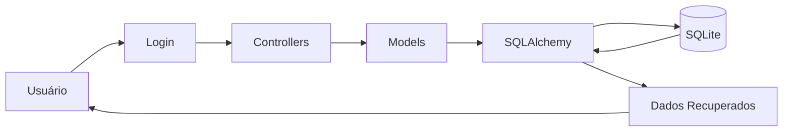

# Fluxo da Funcionalidade - HU14 (Persistência de Dados)

## Descrição

Este documento descreve o funcionamento da persistência de dados no FINE, garantindo que todas as informações cadastradas pelos usuários sejam armazenadas de forma permanente e recuperadas sempre que necessário.

## Responsável

Gabriel Lopes da Silva

## História de Usuário

Como usuário financeiro, quero que meus dados fiquem armazenados com segurança, para que eu não perca minhas informações ao fechar o aplicativo ou sair da sessão.

---

## Definição

A persistência de dados permite que todas as informações financeiras cadastradas sejam armazenadas em banco de dados, permanecendo disponíveis mesmo após o encerramento da aplicação ou realização de logout.

Todos os registros são vinculados ao usuário autenticado, garantindo isolamento das informações entre diferentes contas.

### Características

- Persistência em banco de dados SQLite
- Utilização do SQLAlchemy para gerenciamento dos dados
- Armazenamento permanente das informações
- Associação dos registros ao usuário autenticado
- Recuperação automática dos dados após novo acesso
- Integridade das informações durante operações de cadastro, edição e exclusão

---

## Regras de Negócio

- Todas as informações devem ser armazenadas automaticamente após confirmação da operação.
- Apenas dados pertencentes ao usuário autenticado podem ser recuperados.
- O sistema deve preservar os dados após encerramento da aplicação ou logout.
- Alterações realizadas devem ser refletidas imediatamente no banco de dados.
- Exclusões devem remover permanentemente o registro correspondente.
- O sistema deve manter a consistência dos relacionamentos entre usuários, categorias, receitas, despesas e metas.

---

## Fluxo da Funcionalidade

### Armazenamento

1. Usuário realiza uma operação de cadastro, edição ou exclusão.

2. Sistema valida os dados informados.

3. Caso a operação seja válida:

- Atualiza o banco de dados.
- Confirma a transação.
- Mantém os dados disponíveis para futuras consultas.

---

### Recuperação

4. Usuário realiza autenticação.

5. Sistema identifica o usuário da sessão.

6. Sistema consulta o banco de dados.

7. Apenas os registros pertencentes ao usuário autenticado são carregados.

---

### Atualização

8. Sempre que ocorrer:

- Cadastro;
- Edição;
- Exclusão;

o banco de dados é atualizado automaticamente.

---

## Critérios de Aceitação

**CA01 — Armazenamento**

Dado que o usuário realize uma operação válida

Quando confirmar a ação

Então o sistema deve armazenar as informações no banco de dados.

---

**CA02 — Recuperação**

Dado que existam informações previamente cadastradas

Quando o usuário realizar login novamente

Então o sistema deve recuperar automaticamente seus dados.

---

**CA03 — Isolamento dos dados**

Dado que existam múltiplos usuários cadastrados

Quando um usuário acessar o sistema

Então apenas seus próprios registros devem ser exibidos.

---

**CA04 — Integridade**

Dado que uma operação seja concluída

Quando o banco de dados for atualizado

Então as informações devem permanecer consistentes e relacionadas corretamente.

---

**CA05 — Persistência**

Dado que o usuário encerre a aplicação ou realize logout

Quando acessar novamente o sistema

Então todas as informações previamente cadastradas devem permanecer disponíveis.

---

## Diagrama (Mermaid)

