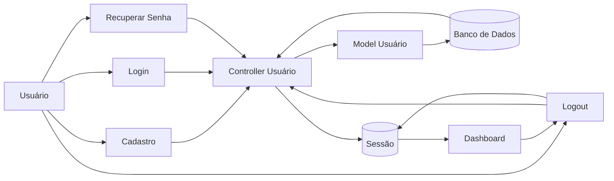

# Fluxo da Funcionalidade - HU15 (Login e Autenticação)

## Descrição

Este documento descreve o fluxo completo da funcionalidade de autenticação de usuários do FINE, incluindo cadastro de contas, login, controle de sessão, recuperação de senha e logout.

## Responsável

Gabriel Lopes da Silva

## História de Usuário

Como usuário do sistema, quero realizar login na aplicação, para acessar minhas informações de forma segura.

---

## Definição

A autenticação permite validar a identidade do usuário por meio de credenciais previamente cadastradas, garantindo acesso apenas às suas próprias informações financeiras.

O sistema também disponibiliza cadastro de novos usuários, recuperação de senha por pergunta secreta e controle de sessão durante toda a utilização da aplicação.

### Características

- Cadastro de usuários
- Login com autenticação
- Senhas armazenadas de forma criptografada
- Controle de sessão
- Proteção das rotas do sistema
- Recuperação de senha por pergunta secreta
- Logout

---

## Regras de Negócio

- Apenas usuários cadastrados podem realizar login.
- A senha deve ser armazenada utilizando criptografia.
- Cada usuário deve acessar apenas seus próprios dados.
- Rotas protegidas exigem autenticação.
- Usuários autenticados não podem acessar novamente a tela de login.
- O logout deve invalidar completamente a sessão.
- A redefinição de senha depende da validação da pergunta secreta cadastrada.

---

## Fluxo da Funcionalidade

### Cadastro

1. Usuário acessa a tela de criação de conta.

2. Sistema apresenta formulário contendo:

- Nome;
- E-mail;
- Senha;
- Data de nascimento;
- Pergunta secreta;
- Resposta secreta.

3. Sistema valida os dados.

4. Caso válidos:

- Criptografa a senha.
- Salva o usuário no banco de dados.

---

### Login

5. Usuário acessa a tela de login.

6. Informa:

- E-mail;
- Senha.

7. Sistema valida:

- Existência do usuário;
- Senha informada;
- Credenciais corretas.

8. Caso válidas:

- Cria a sessão do usuário.
- Redireciona para a Dashboard.

---

### Controle de sessão

9. Durante toda a navegação:

- Sistema verifica se existe sessão ativa.
- Caso contrário, redireciona automaticamente para o login.

---

### Recuperação de senha

10. Usuário acessa **Esqueci minha senha**.

11. Sistema solicita:

- E-mail;
- Pergunta secreta;
- Resposta secreta.

12. Caso a validação seja bem-sucedida:

- Permite definir uma nova senha.

---

### Logout

13. Usuário seleciona **Sair**.

14. Sistema:

- Encerra a sessão.
- Remove os dados de autenticação.
- Redireciona para a tela de login.

---

## Critérios de Aceitação

**CA01 — Cadastro**

Dado que o usuário informe dados válidos

Quando concluir o cadastro

Então sua conta deve ser criada com sucesso.

---

**CA02 — Login**

Dado que o usuário possua uma conta válida

Quando informar credenciais corretas

Então o sistema deve autenticar o usuário.

---

**CA03 — Credenciais inválidas**

Dado que o usuário informe dados incorretos

Quando tentar realizar login

Então o sistema deve impedir o acesso e informar o erro.

---

**CA04 — Controle de sessão**

Dado que o usuário não esteja autenticado

Quando tentar acessar uma área protegida

Então o sistema deve redirecioná-lo para a tela de login.

---

**CA05 — Recuperação de senha**

Dado que o usuário valide corretamente sua pergunta secreta

Quando definir uma nova senha

Então o sistema deve atualizar a senha cadastrada.

---

**CA06 — Logout**

Dado que o usuário esteja autenticado

Quando realizar logout

Então sua sessão deve ser encerrada e ele deve ser redirecionado para a tela de login.

---

## Diagrama (Mermaid)

