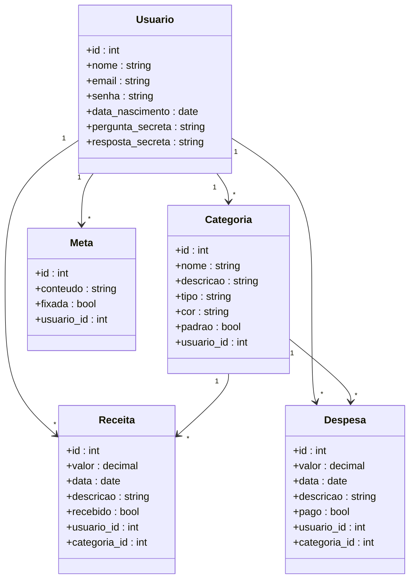

# Diagrama de Classes

## Descrição

Este documento apresenta o Diagrama de Classes do FINE (Finance Is Now Easy), representando as principais entidades do sistema e seus relacionamentos conforme a arquitetura MVC implementada.

As classes apresentadas correspondem aos modelos responsáveis pela persistência dos dados da aplicação.

---

## Classes

- Usuario
- Receita
- Despesa
- Categoria
- Meta

---

## Diagrama (Mermaid)

---

## Descrição dos Relacionamentos

- Um usuário pode possuir diversas receitas.
- Um usuário pode possuir diversas despesas.
- Um usuário pode possuir diversas categorias.
- Um usuário pode possuir diversas metas.
- Uma categoria pode classificar várias receitas.
- Uma categoria pode classificar várias despesas.

---

## Observações

O diagrama representa as principais classes responsáveis pela persistência de dados da aplicação, implementadas utilizando SQLAlchemy. Cada usuário possui seu próprio conjunto de categorias, receitas, despesas e metas, garantindo isolamento das informações entre diferentes contas.