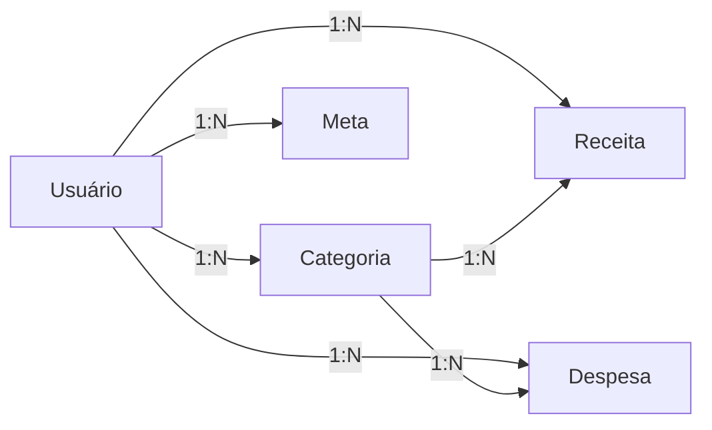

# Modelo Entidade-Relacionamento

## Descrição

Este documento apresenta o Modelo Entidade-Relacionamento (MER) do FINE, representando as principais entidades do sistema e seus relacionamentos.

---

## Diagrama (Mermaid)

---

## Entidades

### Usuário
- id (PK)
- nome
- email
- senha
- data_nascimento
- pergunta_secreta
- resposta_secreta

### Categoria
- id (PK)
- nome
- descricao
- tipo
- cor
- padrao
- usuario_id (FK)

### Receita
- id (PK)
- valor
- data
- descricao
- recebido
- usuario_id (FK)
- categoria_id (FK)

### Despesa
- id (PK)
- valor
- data
- descricao
- pago
- usuario_id (FK)
- categoria_id (FK)

### Meta
- id (PK)
- conteudo
- fixada
- usuario_id (FK)